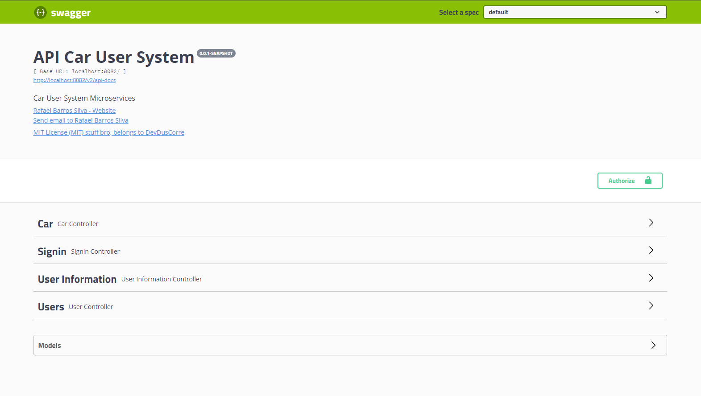
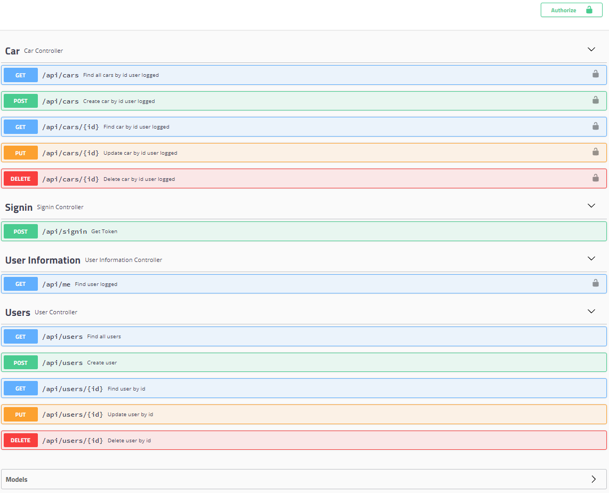
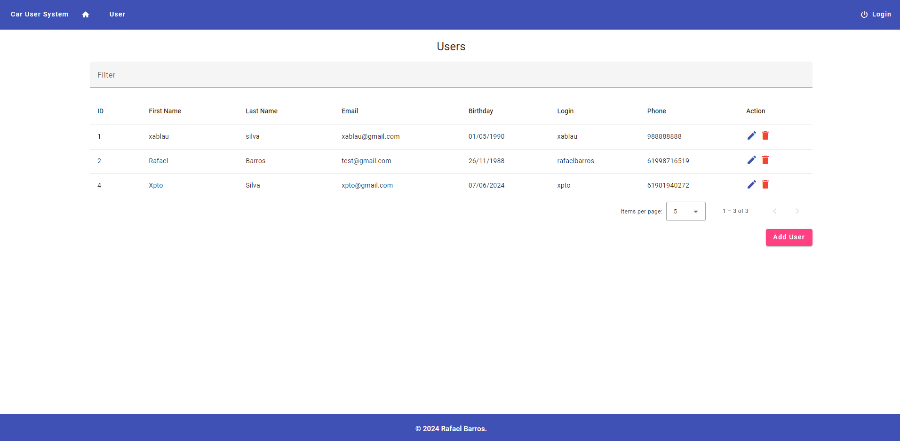
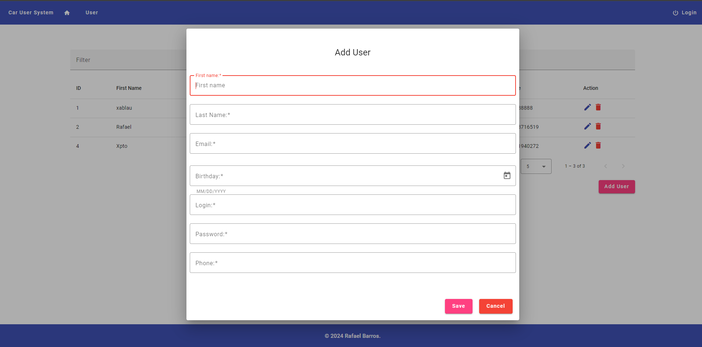
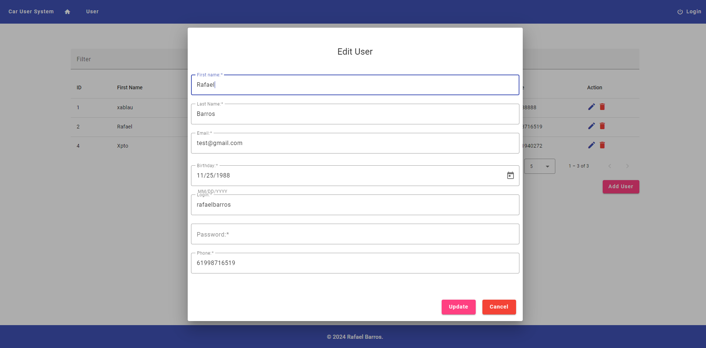
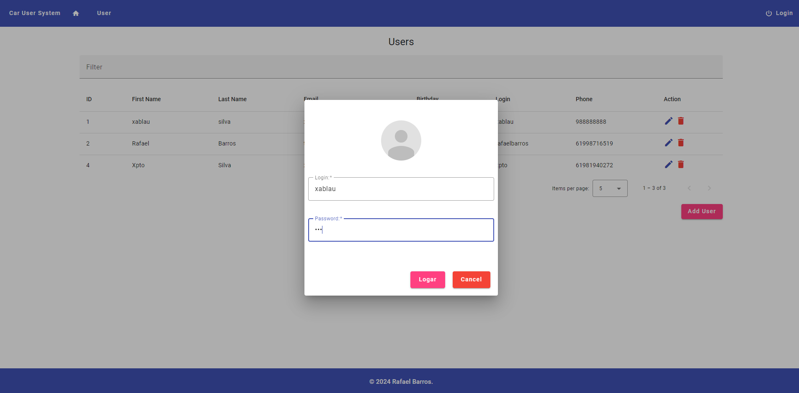
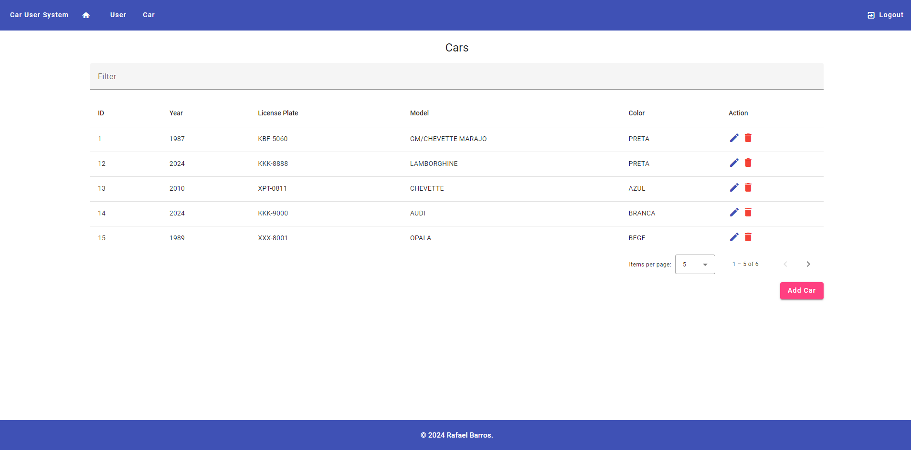
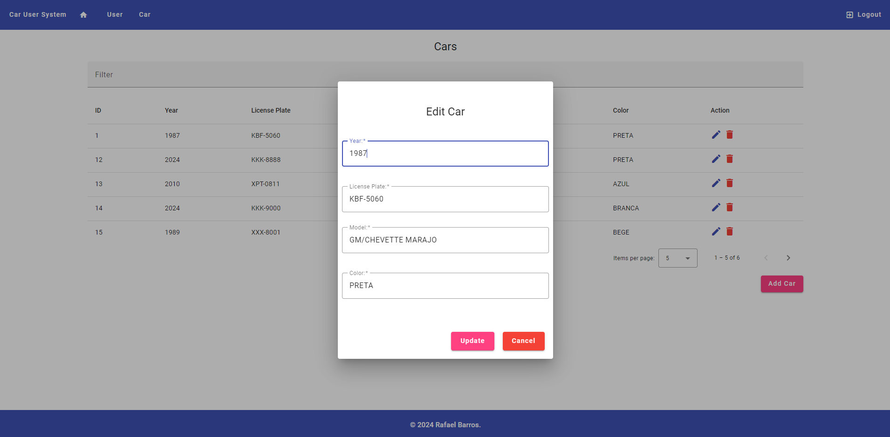

# Desafio Java Pitang

## História de Usuário

Como desenvolvedor encarregado do backend de um Sistema de Usuários de Carros, busco criar uma API RESTful para simplificar o gerenciamento de usuários e seus respectivos carros.

### História de Usuário: Gerenciar Autenticação e Usuários

**Descrição:**
Como um administrador do sistema,
Gostaria de gerenciar autenticação e informações de usuários,
Para garantir o acesso seguro e a integridade dos dados no sistema.

### Critérios de Aceitação:

- [x] ✅ 1. Como usuário, desejo realizar autenticação fornecendo meu login e senha e retornando o token de acesso.
- [x] ✅ 2. Como usuário, desejo listar todos os usuários.
- [x] ✅ 3. Como usuário, desejo cadastrar um novo usuário com os seguintes campos: nome, sobrenome, e-mail, data de nascimento, login, senha, telefone e carros.
- [x] ✅ 4. Como usuário, desejo buscar um usuário pelo id.
- [x] ✅ 5. Como usuário, desejo remover um usuário pelo id.
- [x] ✅ 6. Como usuário, desejo atualizar um usuário pelo id.

### Especificações:

**Rotas que NÃO exigem autenticação:**

- **POST /api/signin**

  - **Descrição:** Realiza autenticação do usuário e retorna o token de acesso.
  - **Erros Possíveis:**
    - Login inexistente ou senha inválida: "Invalid login or password"

- **GET /api/users**

  - **Descrição:** Lista todos os usuários cadastrados.
  - **Erros Possíveis:** Nenhum

- **POST /api/users**

  - **Descrição:** Cadastra um novo usuário.
  - **Erros Possíveis:**
    - E-mail já existente: "Email already exists"
    - Login já existente: "Login already exists"
    - Campos inválidos: "Invalid fields"
    - Campos não preenchidos: "Missing fields"

- **GET /api/users/{id}**

  - **Descrição:** Busca um usuário pelo id.
  - **Erros Possíveis:** Nenhum

- **DELETE /api/users/{id}**

  - **Descrição:** Remove um usuário pelo id.
  - **Erros Possíveis:** Nenhum

- **PUT /api/users/{id}**
  - **Descrição:** Atualiza um usuário pelo id.
  - **Erros Possíveis:**
    - Campos inválidos: "Invalid fields"
    - Campos não preenchidos: "Missing fields"

### História de Usuário: Gerenciar Perfil do Usuário

**Descrição:**
Como um usuário autenticado,
Gostaria de visualizar as minhas informações.

### Critérios de Aceitação:

- [x] ✅ 1. Como usuário autenticado, consultar as minhas as informações de usuário logado (firstName, lastName, email, birthday, login,
      phone, cars) + createdAt (data da criação do usuário) + lastLogin (data da última vez que o usuário realizou login).

### Especificações:

**Rotas:**

- **GET /api/me**
  - **Descrição:** Retorna as informações do usuário logado, incluindo detalhes do perfil e metadados.
  - **Erros Possíveis:**
    1. Token não enviado: "Unauthorized"
    2. Token expirado: "Unauthorized - invalid session"

### História de Usuário: Gerenciar Carros do Usuário

**Descrição:**
Como um usuário autenticado,
Gostaria de gerenciar meus carros cadastrados,
Para manter meus dados atualizados no sistema.

### Critérios de Aceitação:

- [x] ✅ 1. Como usuário autenticado, desejo listar todos os carros do usuário autenticado.
- [x] ✅ 2. Como usuário autenticado, desejo cadastrar um novo carro para o usuário autenticado.
- [x] ✅ 3. Como usuário autenticado, desejo buscar um carro do usuário autenticado pelo id.
- [x] ✅ 4. Como usuário autenticado, desejo remover um carro do usuário autenticado pelo id.
- [x] ✅ 5. Como usuário autenticado, desejo atualizar um carro do usuário autenticado pelo id.

### Especificações:

**Rotas:**

- **GET /api/cars**

  - **Descrição:** Lista todos os carros cadastrados pelo usuário logado.
  - **Erros Possíveis:**
    1. Token não enviado: "Unauthorized"
    2. Token expirado: "Unauthorized - invalid session"

- **POST /api/cars**

  - **Descrição:** Cadastra um novo carro para o usuário logado.
  - **Erros Possíveis:**
    1. Token não enviado: "Unauthorized"
    2. Token expirado: "Unauthorized - invalid session"
    3. Placa já existente: "License plate already exists"
    4. Campos inválidos: "Invalid fields"
    5. Campos não preenchidos: "Missing fields"

- **GET /api/cars/{id}**

  - **Descrição:** Busca um carro do usuário logado pelo id.
  - **Erros Possíveis:**
    1. Token não enviado: "Unauthorized"
    2. Token expirado: "Unauthorized - invalid session"

- **DELETE /api/cars/{id}**

  - **Descrição:** Remove um carro do usuário logado pelo id.
  - **Erros Possíveis:**
    1. Token não enviado: "Unauthorized"
    2. Token expirado: "Unauthorized - invalid session"

- **PUT /api/cars/{id}**
  - **Descrição:** Atualiza um carro do usuário logado pelo id.
  - **Erros Possíveis:**
    1. Token não enviado: "Unauthorized"
    2. Token expirado: "Unauthorized - invalid session"
    3. Campos inválidos: "Invalid fields"
    4. Campos não preenchidos: "Missing fields"

# Solução

Nesta seção, detalhamos as justificativas e defesa técnica para a escolha das tecnologias utilizadas no projeto.

## Back-end

### Java 8

Java 8 foi escolhido por sua robustez e maturidade. A versão inclui recursos importantes como a API de Streams e expressões lambda, que facilitam a escrita de um código mais conciso e eficiente.

### Maven

Maven é utilizado para gerenciamento de dependências e build. Ele simplifica o processo de construção do projeto, garantindo que todas as dependências sejam resolvidas de forma consistente e proporcionando um modelo de configuração padronizado.

### Mapstruct

MapStruct é utilizado para mapeamento de objetos, eliminando a necessidade de escrever código boilerplate para conversão entre diferentes tipos de objetos. Isso aumenta a produtividade e reduz erros.

### JWT (JSON Web Token)

JWT é empregado para autenticação e autorização. Ele fornece uma forma segura e compacta de transmitir informações entre as partes como um objeto JSON, que pode ser verificado e confiável porque é assinado digitalmente.

### Banco de Dados MySQL

MySQL foi escolhido por ser um sistema de gerenciamento de banco de dados relacional amplamente utilizado e confiável. Ele oferece alto desempenho, segurança e facilidade de uso, tornando-o uma excelente escolha para aplicações de produção.

### Framework Spring Boot 2

Spring Boot 2 facilita a criação de aplicações Java stand-alone e produção-grade. Ele oferece configuração automática, métricas, segurança e outros recursos prontos para uso, reduzindo o tempo de desenvolvimento e aumentando a produtividade.

### Balanceador de Cargas e Service Registry (Eureka e Zuul)

- **Eureka**: Usado como serviço de registro para permitir a descoberta de serviços em uma arquitetura de microserviços. Ele facilita a comunicação entre serviços, permitindo que se registrem e descubram uns aos outros.
- **Zuul**: Atua como um gateway de API, fornecendo roteamento dinâmico, monitoramento, resiliência, segurança e muito mais. Ele gerencia todas as solicitações e as roteia para os serviços apropriados.

### Testes Unitários

Os testes unitários garantem que cada parte do código funcione corretamente. Utilizamos frameworks como JUnit e Mockito para criar testes robustos que ajudam a prevenir regressões e manter a qualidade do código.

### Swagger

Swagger é utilizado para documentação automática das APIs REST. Ele gera uma interface web interativa onde desenvolvedores e clientes podem visualizar e testar as operações da API, facilitando o desenvolvimento e a integração.

### Docker

Docker é utilizado para containerizar a aplicação, garantindo que ela possa ser executada de forma consistente em qualquer ambiente. Isso facilita o desenvolvimento, teste e implantação contínuos.

## Front-end

### Angular 17

Angular 17 foi escolhido por ser um framework moderno e robusto para desenvolvimento de aplicações web. Ele oferece uma arquitetura bem definida, duas vias de data binding e um ecossistema rico, permitindo a criação de aplicações escaláveis e de alta performance.

### Bootstrap

Bootstrap é utilizado para estilização e design responsivo. Ele fornece uma coleção de componentes CSS e JavaScript que facilitam a criação de interfaces de usuário atraentes e funcionais com um esforço mínimo.

# Instalação

### Requisitos

- Java 8
- Maven
- Docker
- Angular 17
- Node.js
- NPM

### Executar a Aplicação em Docker

- 1. Subir o Docker Compose:

  ```ruby
    docker --version
    Docker version 25.0.3, build 4debf41
  ```

  ```ruby
    docker-compose --version
    Docker Compose version v2.24.6-desktop.1
  ```

  ```ruby
    docker-compose up -d
  ```

2. Acessar Aplicação:

   - Navegue para http://localhost

3. Acessar Api:

   - Navegue para http://localhost:8080/gateway/back-end/swagger-ui.html

### Executar a Aplicação Local

1. Subir aplicação back-end:

```ruby
  cd car-user-system
```

```ruby
  docker --version
  Docker version 25.0.3, build 4debf41
```

```ruby
  docker-compose --version
  Docker Compose version v2.24.6-desktop.1
```

Subindo o banco de dados

```ruby
  docker-compose -f back-end/docker-compose.yml up -d

  [+] Running 1/3
    ⠸ Network back-end_backend               Created 0.4s
    ⠸ Volume "back-end_db-car-user-system"   Created 0.3s
    ✔ Container db-back                      Started
```

Maven

```ruby
  mvn --version
```

```ruby
  Apache Maven 3.9.6 (bc0240f3c744dd6b6ec2920b3cd08dcc295161ae)
  Maven home: /home/rafael/envs/tools/maven-3.9.6
  Java version: 1.8.0_402, vendor: Temurin, runtime: /home/rafael/.sdkman/candidates/java/8.0.402-tem/jre
  Default locale: en, platform encoding: UTF-8
  OS name: "linux", version: "5.15.146.1-microsoft-standard-wsl2", arch: "amd64", family: "unix"
```

```sh
  mvn clean install
```

```ruby
  [INFO] ------------------------------------------------------------------------
  [INFO] Reactor Summary:
  [INFO]
  [INFO] car-user-system 1.0-SNAPSHOT ....................... SUCCESS [  0.348 s]
  [INFO] core 1.0-SNAPSHOT .................................. SUCCESS [  5.006 s]
  [INFO] token 1.0-SNAPSHOT ................................. SUCCESS [  0.505 s]
  [INFO] back-end 0.0.1-SNAPSHOT ............................ SUCCESS [  8.181 s]
  [INFO] discovery 0.0.1-SNAPSHOT ........................... SUCCESS [  1.814 s]
  [INFO] gateway 0.0.1-SNAPSHOT ............................. SUCCESS [  1.885 s]
  [INFO] auth 0.0.1-SNAPSHOT ................................ SUCCESS [  1.740 s]
  [INFO] ------------------------------------------------------------------------
  [INFO] BUILD SUCCESS
  [INFO] ------------------------------------------------------------------------
  [INFO] Total time:  19.741 s
  [INFO] Finished at: 2024-06-06T02:18:22-03:00
  [INFO] ------------------------------------------------------------------------
```

```ruby
  java -version
  openjdk version "1.8.0_402"
  OpenJDK Runtime Environment (Temurin)(build 1.8.0_402-b06)
  OpenJDK 64-Bit Server VM (Temurin)(build 25.402-b06, mixed mode)
```

Abrir um terminal pra cada aplicação

### 1. Discovery (Eureka)

```ruby
  java -jar discovery/target/discovery.jar

  2024-06-06 02:27:12.792  INFO 38693 --- [      Thread-11] o.s.c.n.e.server.EurekaServerBootstrap   : Initialized server context
  2024-06-06 02:27:12.792  INFO 38693 --- [      Thread-11] c.n.e.r.PeerAwareInstanceRegistryImpl    : Got 1 instances from neighboring DS node
  2024-06-06 02:27:12.792  INFO 38693 --- [      Thread-11] c.n.e.r.PeerAwareInstanceRegistryImpl    : Renew threshold is: 1
  2024-06-06 02:27:12.792  INFO 38693 --- [      Thread-11] c.n.e.r.PeerAwareInstanceRegistryImpl    : Changing status to UP
  2024-06-06 02:27:12.804  INFO 38693 --- [      Thread-11] e.s.EurekaServerInitializerConfiguration : Started Eureka Server
  2024-06-06 02:27:12.819  INFO 38693 --- [           main] o.s.b.w.embedded.tomcat.TomcatWebServer  : Tomcat started on port(s): 8081 (http) with context path ''
  2024-06-06 02:27:12.820  INFO 38693 --- [           main] .s.c.n.e.s.EurekaAutoServiceRegistration : Updating port to 8081
  2024-06-06 02:27:13.821  INFO 38693 --- [           main] o.s.cloud.commons.util.InetUtils         : Cannot determine local hostname
  2024-06-06 02:27:13.822  INFO 38693 --- [           main] b.c.r.discovery.DiscoveryApp             : Started DiscoveryApp in 11.136 seconds (JVM running for 11.576)
```

### 2. Gateway (Zuul)

```ruby
  java -jar gateway/target/gateway.jar

  2024-06-06 02:33:28.797  INFO 43126 --- [           main] b.c.r.gateway.security.GatewayApp        : Started GatewayApp in 11.596 seconds (JVM running for 12.057)
  2024-06-06 02:33:57.710  INFO 43126 --- [freshExecutor-0] com.netflix.discovery.DiscoveryClient    : Disable delta property : false
  2024-06-06 02:33:57.711  INFO 43126 --- [freshExecutor-0] com.netflix.discovery.DiscoveryClient    : Single vip registry refresh property : null
  2024-06-06 02:33:57.711  INFO 43126 --- [freshExecutor-0] com.netflix.discovery.DiscoveryClient    : Force full registry fetch : false
  2024-06-06 02:33:57.711  INFO 43126 --- [freshExecutor-0] com.netflix.discovery.DiscoveryClient    : Application is null : false
  2024-06-06 02:33:57.711  INFO 43126 --- [freshExecutor-0] com.netflix.discovery.DiscoveryClient    : Registered Applications size is zero : true
  2024-06-06 02:33:57.711  INFO 43126 --- [freshExecutor-0] com.netflix.discovery.DiscoveryClient    : Application version is -1: false
  2024-06-06 02:33:57.711  INFO 43126 --- [freshExecutor-0] com.netflix.discovery.DiscoveryClient    : Getting all instance registry info from the eureka server
  2024-06-06 02:33:57.751  INFO 43126 --- [freshExecutor-0] com.netflix.discovery.DiscoveryClient    : The response status is 200
```

### 3. Auth (Security)

```ruby
  java -jar auth/target/auth.jar

  2024-06-06 02:55:33.139  INFO 57307 --- [nfoReplicator-0] com.netflix.discovery.DiscoveryClient    : DiscoveryClient_AUTH/localhost:auth:8083: registering service...
  2024-06-06 02:55:33.178  INFO 57307 --- [           main] o.s.b.w.embedded.tomcat.TomcatWebServer  : Tomcat started on port(s): 8083 (http) with context path ''
  2024-06-06 02:55:33.179  INFO 57307 --- [           main] .s.c.n.e.s.EurekaAutoServiceRegistration : Updating port to 8083
  2024-06-06 02:55:33.181  INFO 57307 --- [nfoReplicator-0] com.netflix.discovery.DiscoveryClient    : DiscoveryClient_AUTH/localhost:auth:8083 - registration status: 204
  2024-06-06 02:55:34.180  INFO 57307 --- [           main] o.s.cloud.commons.util.InetUtils         : Cannot determine local hostname
  2024-06-06 02:55:34.182  INFO 57307 --- [           main] b.c.rafaellbarros.auth.security.AuthApp  : Started AuthApp in 11.347 seconds (JVM running for 11.693)
```

### 4. Back-End (Api)

```ruby
  java -jar back-end/target/back-end.jar

  2024-06-06 02:58:12.503  INFO 59435 --- [nfoReplicator-0] com.netflix.discovery.DiscoveryClient    : DiscoveryClient_BACK-END/localhost:back-end:8082 - registration status: 204
  2024-06-06 02:58:12.507  INFO 59435 --- [           main] s.d.s.w.s.ApiListingReferenceScanner     : Scanning for api listing references
  2024-06-06 02:58:12.637  INFO 59435 --- [           main] o.s.b.w.embedded.tomcat.TomcatWebServer  : Tomcat started on port(s): 8082 (http) with context path ''
  2024-06-06 02:58:12.638  INFO 59435 --- [           main] .s.c.n.e.s.EurekaAutoServiceRegistration : Updating port to 8082
  2024-06-06 02:58:13.638  INFO 59435 --- [           main] o.s.cloud.commons.util.InetUtils         : Cannot determine local hostname
  2024-06-06 02:58:13.640  INFO 59435 --- [           main] br.com.rafaellbarros.backend.BackEndApp  : Started BackEndApp in 11.607 seconds (JVM running for 12.01)
  2024-06-06 02:58:13.642  INFO 59435 --- [           main] br.com.rafaellbarros.backend.BackEndApp  :

  ***

          Aplicacao back-end iniciada com sucesso!
          Disponivel nos enderecos:
          Local: http://localhost:8082
          Swagger Local Url: http://localhost:8082/swagger-ui.html

  ***

  2024-06-06 02:59:28.628  INFO 59435 --- [nio-8082-exec-1] o.a.c.c.C.[Tomcat].[localhost].[/]       : Initializing Spring DispatcherServlet 'dispatcherServlet'
  2024-06-06 02:59:28.629  INFO 59435 --- [nio-8082-exec-1] o.s.web.servlet.DispatcherServlet        : Initializing Servlet 'dispatcherServlet'
  2024-06-06 02:59:28.639  INFO 59435 --- [nio-8082-exec-1] o.s.web.servlet.DispatcherServlet        : Completed initialization in 10 ms
```





### 5. Executando aplicações somente em um terminal

Executando script para subir as aplicações somente em um terminal

```ruby
  chmod +x start-car-user-system-runner.sh
```

```ruby
  ./start-car-user-system-runner.sh
```

Executando script para parar as aplicações somente em um terminal

```ruby
  chmod +x stop-car-user-system-runner.sh
```

```ruby
  ./stop-car-user-system-runner.sh
```

2. Subir aplicação front-end:

```ruby
  cd front-car-user-system
```

```ruby
  node --version
  10.4.0
```

```ruby
  npm install

  120 packages are looking for funding
  run `npm fund` for details

  found 0 vulnerabilities
  npm notice
  npm notice New minor version of npm available! 10.4.0 -> 10.8.1
  npm notice Changelog: https://github.com/npm/cli/releases/tag/v10.8.1
  npm notice Run npm install -g npm@10.8.1 to update!
  npm notice
```

```ruby
  ng serve

  Application bundle generation complete. [1.860 seconds]

  Watch mode enabled. Watching for file changes...
    ➜  Local:   http://localhost:4200/
    ➜  press h + enter to show help
```












